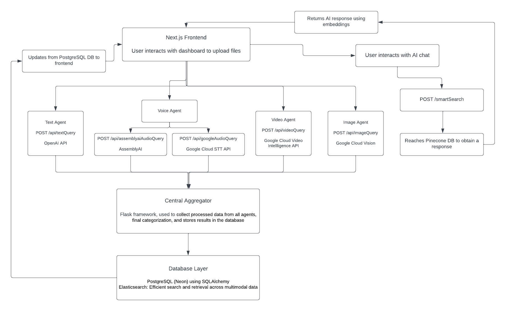

# Fullstack Project Documentation

## Overview

This project is a comprehensive full-stack application that leverages a variety of modern technologies to provide a robust and scalable solution. The backend is built using Flask and Python, while the frontend is developed with Next.js. The application integrates several APIs and services, including OpenAI, AssemblyAI, Google Cloud Vision API, and Google Cloud Speech-to-Text. Additionally, it utilizes Docker for containerization and Pinecone/Langchain for the RAG Pipeline.

## Technologies Used

- **Backend**: Flask, Python, SQLAlchemy, OpenAI API, AssemblyAI, Google Cloud Vision API, Google Cloud Speech-to-Text, Pinecone, Langchain, Neondb
- **Frontend**: Next.js, JavaScript
- **Containerization**: Docker
- **Database**: Neondb PostgreSQL (via SQLAlchemy)
- **Others**: Axios, Chart.js, React Icons, ESLint

## Project Structure

### Backend

The backend is organized into several key components:

- **Flask Application**: The main application logic is handled by Flask, with routes defined for various functionalities.
- **Database Models**: SQLAlchemy is used for ORM, with models defined for users and entries.
- **API Integrations**: Integration with OpenAI, AssemblyAI, and Google Cloud services for various functionalities.
- **Vector Storage**: Pinecone is used for storing and retrieving vector embeddings.

#### Key Files

- `backend/app.py`: Main Flask application setup and route registration.
- `backend/requirements.txt`: List of Python dependencies.
- `backend/flask.dockerfile`: Dockerfile for building the Flask application.
- `backend/routes/`: Directory containing route definitions for different functionalities.
- `backend/chatScripts/`: Directory containing scripts for processing and handling chat-related tasks.


### Frontend

The frontend is built using Next.js, a React framework that enables server-side rendering and static site generation.

#### Key Files

- `frontend/package.json`: Contains project metadata and dependencies.
- `frontend/next.config.mjs`: Next.js configuration file.
- `frontend/README.md`: Instructions for setting up and running the frontend.
- `frontend/next.dockerfile`: Dockerfile for building the Next.js application.


## Setup Instructions

### Backend

1. **Clone the repository**:
   ```bash
   git clone <repository-url>
   cd backend
   ```

2. **Set up a virtual environment**:
   ```bash
   python3 -m venv venv
   source venv/bin/activate
   ```

3. **Install dependencies**:
   ```bash
   pip install -r requirements.txt
   ```

4. **Set up environment variables**:
   Create a `.env` file in the `backend` directory and add the necessary environment variables:
   ```plaintext
   OPENAI_API_KEY=<your-openai-api-key>
   PINECONE_API_KEY=<your-pinecone-api-key>
   GOOGLE_APPLICATION_CREDENTIALS=<path-to-google-credentials-json>
   CLOUD_STORAGE_BUCKET=<your-gcs-bucket-name>
   DATABASE_URL=<your-database-url>
   ```

5. **Run the application**:
   ```bash
   python3 app.py
   ```

### Frontend

1. **Navigate to the frontend directory**:
   ```bash
   cd frontend
   ```

2. **Install dependencies**:
   ```bash
   npm install
   ```

3. **Run the development server**:
   ```bash
   npm run dev
   ```

4. **Open the application**:
   Open [http://localhost:3000](http://localhost:3000) in your browser to see the result.

#### Architectural Diagram



### Docker

To run the application using Docker: **Do not**

** Don't do this. It broke our whole project. Will be fixed soon **

1. **Build and run the backend container**:
   ```bash
   docker build -t backend -f backend/flask.dockerfile .
   docker run -p 4000:4000 backend
   ```

2. **Build and run the frontend container**:
   ```bash
   docker build -t frontend -f frontend/next.dockerfile .
   docker run -p 3000:3000 frontend
   ```

## Additional Resources

- [Next.js Documentation](https://nextjs.org/docs)
- [Flask Documentation](https://flask.palletsprojects.com/)
- [OpenAI API Documentation](https://beta.openai.com/docs/)
- [AssemblyAI Documentation](https://www.assemblyai.com/docs/)
- [Google Cloud Vision API Documentation](https://cloud.google.com/vision/docs)
- [Google Cloud Speech-to-Text Documentation](https://cloud.google.com/speech-to-text/docs)
- [Pinecone Documentation](https://docs.pinecone.io/)

